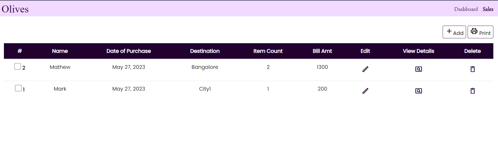
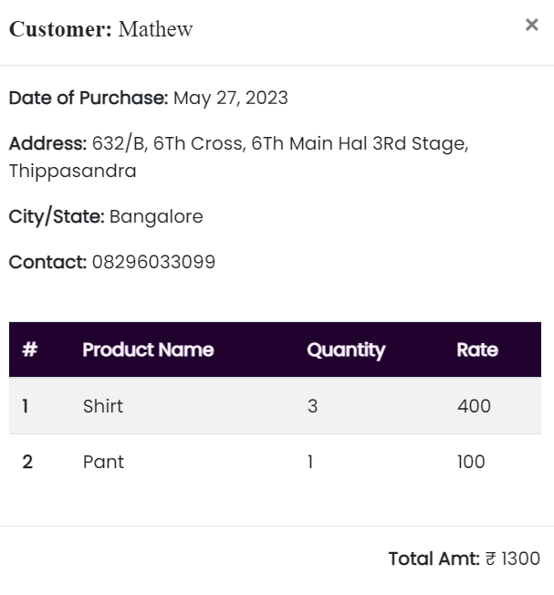

# Inventory Management System

This is a Flask-based web application for managing inventory and orders. It allows users to perform the following actions:

- Add new orders.
- Edit existing orders.
- Delete orders.
- View a list of all orders.
- Print individual bills for selected orders.

## Getting Started

### Prerequisites

Before running the application, ensure you have the following installed:

- Python 3.x
- Flask (can be installed using `pip install Flask`)

### Installation

1. Clone this repository to your local machine: `git clone https://github.com/yourusername/inventory-management.git`
2. Change your working directory to the project folder: `cd inventory-management`
3. Install the project dependencies: `pip install -r requirements.txt`

### Running the Application

Once you've completed the setup, you can run the application using the following command: `flask run`

## Usage

- To add a new order, click on the "Add" button and fill in the order details.
- To edit an existing order, click on the "Edit" button next to the order you want to modify.
- To delete an order, click on the "Delete" button next to the order you want to remove.
- To view a list of all orders, click on the "View Orders" link in the navigation menu.
- To print an individual bill for a specific order, select the order no and click on the "Print" button.

## Demo Images

You can view some demo images of the application below:

  

    
  

  

    
  

## Contributors

- [Nimisha Sara George](https://github.com/nimisha-sara)

